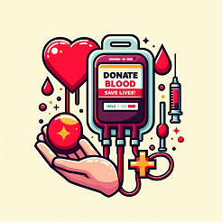

<h1 align="center">
	
</h1>
[(https://github.com/PalomaMuniz777/projetoEstacio/assets/157491085/0422968e-4b43-4016-8a9c-28a04c7762ee)](https://www.canva.com/design/DAGI_QiNjDI/nnHCXfl8KFdMVzL92DCArQ/edit?utm_content=DAGI_QiNjDI&utm_campaign=designshare&utm_medium=link2&utm_source=sharebutton)

<h3 align="center">
	Um sistema minimalista para cadastrar doadores de sangue.
</h3>

## :Instalação:

1. Faça a instalação do editor de código [VS Code](https://code.visualstudio.com);
2. Utilize o [Google Chrome](https://www.google.com/intl/pt-BR/chrome/) com as ferramentas de inspeção de código web;
3. Instale o [Node.js](https://nodejs.org/en/);
4. Instale o [PostgreSQL](https://www.postgresql.org/);
5. Instale o [Postbird](https://www.electronjs.org/apps/postbird).

## Produção

1. Entre na pasta do projeto com `cd projetoEstacio`;
2. Rode o comando `npm init -y`;
3. Instale todas as dependências: `npm install`
4. Configure o arquivo `server.js`:  
    * Ligue o servidor e permita o acesso à alguma porta (3000) `server.listen`;  
    * Configure a apresentação da página, `server.get` e `server.post`;  
    * Configure a template engine `nunjucks`;  
    * Configure o servidor para apresentar os arquivos estáticos `server.use(express.static)`;  
    * Configure o banco de dados.

### Dependências

* `express` (framework para o node.js);
* `nodemon` (realiza auto-restart da aplicação ao salvar um arquivo modificado);
* `nunjucks` (template engine que permite manipular os conteúdos html de maneira mais fácil, intuitiva e dinâmica);
* `pg` (permite conexão com o banco de dados)

## Execução

1. Faça o clone do repositório;
2. Instale as dependências do projeto `npm install`;
3. Rode o servidor com `npm start` ou `nodemon server.js`.

### Tecnologias

* `HTML` (estrutura);
* `CSS` (estilo);
* `JavaScript` (inteligência);
* `Node.js` (sevidor, motor de JavaScript);
* `PostgreSQL` (banco de dados).

### Apresentação

    Você sabia que uma simples doação de sangue pode salvar até 3 vidas?
      
    No cenário brasileiro, a doação de sangue ainda não é uma prática comum. Embora sejamos constantemente lembrados da importância de doar sangue através de diversas campanhas, apenas <b>1,9%</b> da população brasileira realiza essa doação regularmente. Todos os dias, mais de <b>38.000</b> doações são necessárias para atender à demanda dos hemocentros.
      
    Este projeto visa alcançar mais pessoas por meio de sua disponibilidade na web, facilitando a localização de doadores com tipos sanguíneos específicos. Além disso, permite o contato direto via e-mail quando houver necessidade de doações de um determinado tipo sanguíneo.

### Extensões

* `Live Server`: Ritwick Dey - permite atualização automática da conteúdo da página `HTML`.

### Sites

* [CSS-Tricks](https://css-tricks.com);
* [Google Fonts](https://fonts.google.com/);
* [Imgur](https://imgur.com/).

## Licença

Este projeto está licenciado sob a Licença MIT. Veja o arquivo [LICENSE](LICENSE.md) para mais detalhes.
